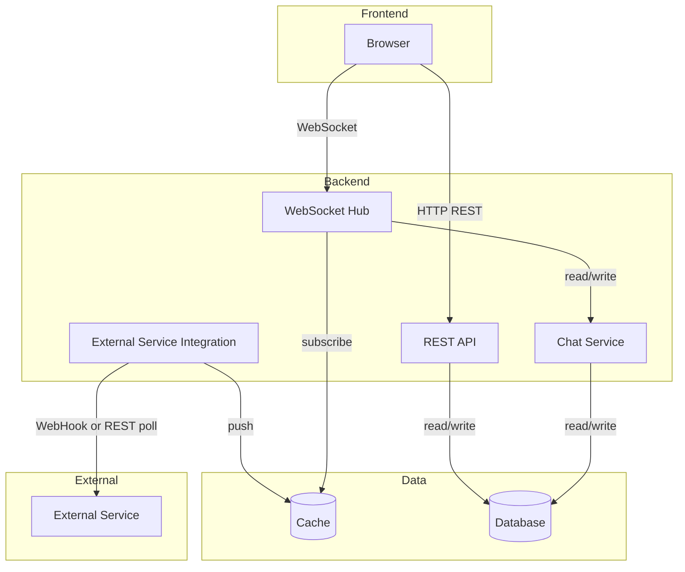

High-Level Architecture
=======================

What
----

High-level architecture defines the major components and how they interact.
At this stage, avoid implement detail.
The goal is to establish:

- The main services or layers
- The data flows between them
- The communication patterns (sync vs async, push vs pull, etc.)

How
---

Start from the user and work inward:

- Client layer - what do users interact with?
- API / gateway layer - how does the client reach the backend?
- Core services - what are the bounded responsibilities?
- Data stores - what persists, what is ephemeral?
- External integrations - what is outside our control?

Draw or describe the connections.
Label each connection with its protocol.

For Example
-----------

Component responsibilities:

| Component                    | Responsibility                                                                |
| ---------------------------- | ----------------------------------------------------------------------------- |
| REST API                     | Transactions, user data, historical queries - stateless request/response      |
| WebSocket                    | Real-time communication, chat broadcast - stateful connections                |
| Chat Service                 | Message validation, persistence, history retrieval                            |
| External Service Integration | Adapts external service's protocols; normalizes and caches data               |
| Cache                        | Holds current transaction states; serves high-frequency reads without DB hits |
| Database                     | Persists transaction results, chat messages, user records                     |
